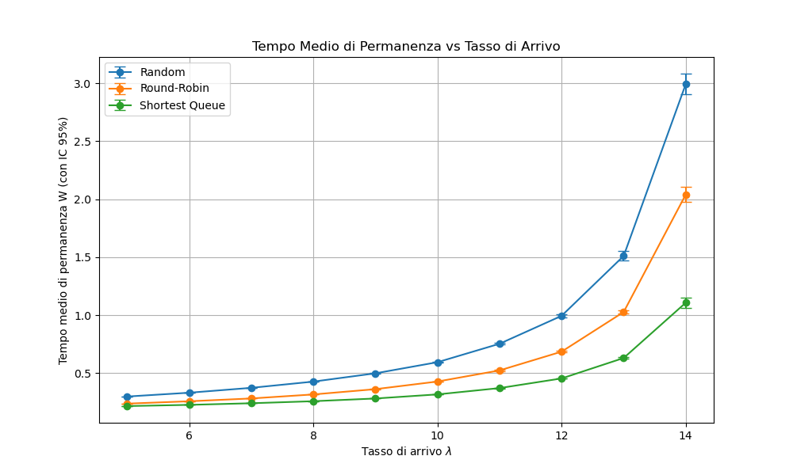
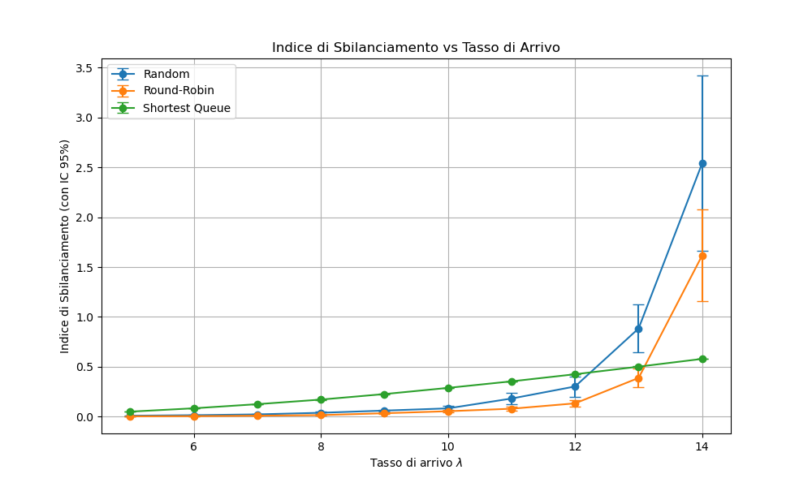

# Relazione Finale - Simulatore Sistema a Code C3

## 1. Introduzione
Il progetto "C3 Queueing System Simulator" modella un sistema costituito da $N$ serventi indipendenti, ciascuno dotato di una propria coda FIFO di capacità infinita. I pacchetti arrivano nel sistema secondo un processo di Poisson di tasso $\lambda$. Quando un pacchetto entra nel sistema, viene immediatamente instradato verso una delle $N$ code in base a una politica scelta, senza possibilità di spostamento successivo tra le code. I tempi di servizio per il servente $i$-esimo sono distribuiti secondo una legge esponenziale negativa di parametro $\mu_i$. 
L'obiettivo è valutare e confrontare tre distinte politiche di instradamento in base al tempo medio di permanenza e al bilanciamento del carico.

## 2. Architettura e Implementazione

### 2.1 Modello a Eventi Discreti
Il sistema è stato implementato in C++ utilizzando il paradigma di simulazione a eventi discreti (DES, Discrete Event Simulation). Il nucleo del programma gestisce una coda di priorità (`std::priority_queue`) ordinata temporalmente, che processa due tipologie di eventi:
- **Arrival (Arrivo)**: Determina l'ingresso di un pacchetto. Viene generato il successivo arrivo in base alla distribuzione esponenziale di parametro $\lambda$. Il pacchetto viene assegnato a un servente in base alla politica di routing, ed entra in coda oppure in servizio (se il servente era libero, scatenando un futuro evento di partenza).
- **Departure (Partenza)**: Indica la fine del servizio per un pacchetto su uno specifico servente. Se la sua coda contiene pacchetti in attesa, un nuovo servizio ha inizio immediatamente.

### 2.2 Assunzioni e Gestione Input
Il simulatore richiede: $N$, $\lambda$, la politica di routing, $N$ tassi di servizio $\mu_i$ e un tempo massimo di simulazione. 
Come da indicazioni (`docs/Plan.md`), nel caso in cui i parametri non siano forniti o siano incompleti (es. meno di $N$ valori per i $\mu_i$), il software assume un default di $1.0$ per i tassi di servizio mancanti, garantendo la robustezza dell'esecuzione. La lunghezza massima predefinita per la simulazione è di 100000 unità di tempo.

### 2.3 Metriche Valutate
1. **Tempo Medio di Permanenza (W)**: Tempo totale tra l'arrivo nel sistema (entrata in coda) e la conclusione del servizio. Viene calcolato sommando i tempi di residenza individuali divisi per il numero totale di pacchetti serviti.
2. **Lunghezza Media della Coda**: Definita come l'integrale nel tempo del numero di pacchetti in attesa presso un servente, diviso per il tempo di simulazione totale.
3. **Indice di Sbilanciamento**: Definito come la differenza tra il massimo e il minimo valore di lunghezza media registrata tra gli $N$ serventi. 

## 3. Politiche di Routing

Sono state implementate e testate tre politiche di assegnazione:

1. **Random**: Un pacchetto viene indirizzato a uno degli $N$ serventi con probabilità uniforme $1/N$. Questa politica modella un sistema in cui il carico è uniformemente distribuito su base statistica a lungo termine, ma le code non sono reattive allo stato in tempo reale.
2. **Round-Robin**: Il routing avviene ciclicamente (servente 1, poi 2, ecc.). Ha il pregio di assegnare lo stesso esatto numero di pacchetti a ogni coda, limitando ulteriormente la variabilità rispetto all'approccio random.
3. **Shortest Queue (Coda più corta)**: Si ispezionano le lunghezze istantanee di tutte le code. Il pacchetto viene assegnato al servente che presenta il numero minimo di pacchetti in coda in quel preciso istante. È la politica "join the shortest queue" (JSQ).

## 4. Risultati Sperimentali

È stata effettuata un'indagine empirica utilizzando $N=3$, tassi di servizio omogenei $\mu_1 = \mu_2 = \mu_3 = 5$, e variando il tasso di arrivo globale $\lambda$ da 5 a 14. 

### 4.1 Tempo Medio di Permanenza (W)

Osservando i risultati, si evince che:
- A tassi di traffico medi ($\lambda \approx 5-9$), la politica **Shortest Queue** e la politica **Round-Robin** offrono prestazioni comparabili ma inferiori (quindi migliori) a **Random**.
- Man mano che $\lambda$ si avvicina alla capacità massima del sistema $\sum \mu_i = 15$, tutte le curve divergono, ma la politica **Shortest Queue** garantisce un $W$ notevolmente più basso. Essendo adattiva, riesce a incanalare i pacchetti sfruttando in tempo reale le inattività dei serventi, mitigando l'esplosione delle code.

### 4.2 Sbilanciamento del Carico

- L'approccio **Random** e **Round-Robin** registrano un indice di sbilanciamento molto basso fintanto che il sistema non è vicino alla saturazione. Essi assegnano il carico ciecamente, ma la statistica omogenea (o la simmetria esatta di RR) genera lunghezze medie simili, anche se il sistema è localmente sbilanciato in un dato istante.
- L'approccio **Shortest Queue**, curiosamente, può produrre in alcuni casi un indice di sbilanciamento delle lunghezze *medie* delle code leggermente più elevato in regimi di traffico intermedio-basso, perché "insegue" le inefficienze istantanee asimmetriche del sistema. Tuttavia, questo sbilanciamento è un effetto collaterale della continua ottimizzazione per l'invio alla coda istantaneamente più scarica, risultando di fatto nella politica più efficiente globalmente per minimizzare i tempi di permanenza. In saturazione ($\lambda \to 15$), Random diverge producendo un enorme sbilanciamento (poiché le deviazioni statistiche si accumulano), mentre Shortest Queue resta molto più "disciplinata".

## 5. Conclusioni
La simulazione conferma i modelli teorici delle reti di code: una politica reattiva (Shortest Queue) offre prestazioni significativamente superiori in regimi ad alto traffico rispetto a politiche "cieche" o non adattive (Random, Round-Robin). RR risulta essere un ottimo compromesso tra l'estrema semplicità di implementazione e delle buone prestazioni generali.
L'architettura del simulatore in C++ ha dimostrato eccellenti performance, capace di elaborare milioni di eventi in poche frazioni di secondo.
